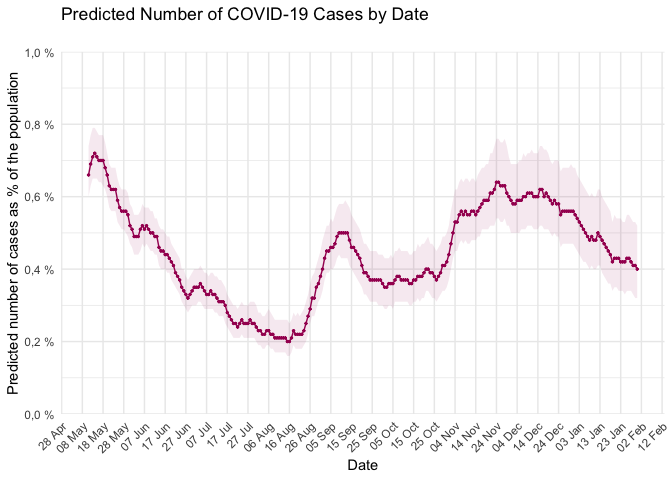

# covidsymptom <a href='https://github.com/csss-resultat/covidsymptom'></a>

<!-- badges: start --->

<!-- badges: end -->

The covidsymptom R package provides an easy way to import open data from
the COVID Symptom Study-Sweden. The package includes three datasets:

  - `national_estimates` - daily estimated incidence of symptomatic
    COVID-19 in Sweden
  - `county_estimates` - daily estimated incidence of symptomatic
    COVID-19 in Swedish counties
  - `postcode_estimates` - daily estimated incidence of symptomatic
    COVID-19 in smaller Swedish regions (2-digit postcodes)

## Installation

Development version of the package can be installed from Github with:

``` r
install.packages("remotes")
remotes::install_github("csss-resultat/covidsymptom")
```

## Update data

Data from COVID Symptom Study - Sweden is updated on a daily basis. If
you want to avoid updating the package to have the most recent data, you
can use the function get\_latest\_data() to import the latest version
available:

``` r
library(covidsymptom)
get_latest_data()

head(level_national)
#>        Datum Uppskattning Low_CI High_CI
#> 1 2020-05-11         0.66   0.60    0.74
#> 2 2020-05-12         0.69   0.63    0.77
#> 3 2020-05-13         0.71   0.65    0.79
#> 4 2020-05-14         0.72   0.65    0.79
#> 5 2020-05-15         0.71   0.65    0.78
#> 6 2020-05-16         0.70   0.64    0.77
```

## Usage

  - National estimates

<!-- end list -->

``` r
library(ggplot2)
library(dplyr)

covidsymptom::national_estimates %>%
  ggplot(aes(x = Datum, y = Uppskattning)) +
  geom_line(col = "#a60f61") +
  geom_point(col = "#a60f61", size = 0.5) +
  labs(x = "Date", y = "Predicted number of cases as % of the population",
       title = "Predicted Number of COVID-19 Cases by Date",
       subtitle = "")  +
  scale_y_continuous(limits = c(0, 1),
                     breaks = seq(0, 1, 0.2),
                     labels = paste0(format(seq(0, 1, 0.2), decimal.mark = ","), " %"), # add % sign to the labels
                     expand = c(0,0)) +
  scale_x_date(date_breaks = "10 days", date_labels = "%d %b") + # can be "1 day", "2 days", etc.
  theme_minimal() +
  theme(axis.text.x = element_text(angle = 45, hjust = 1), panel.grid.minor.x = element_blank()) +
  geom_ribbon(aes(ymin = Low_CI, ymax = High_CI), fill = "#a60f61", alpha = 0.09)
```



  - Counties’ estimates

<!-- end list -->

``` r
library(ggplot2)
library(dplyr)
library(lubridate)

counties_selection <- c("Skåne", "Stockholm", "Västra Götaland", "Uppsala")

covidsymptom::county_estimates %>%
  filter(Lan %in% counties_selection) %>%
  ggplot(aes(x = Datum, y = Uppskattning, color = Lan)) +
      geom_line() +
      geom_point(size = 0.5) +
      labs(x = "Datum", y = "Uppskattad förekomst", title = "% Uppskattad förekomst av symtomatisk covid-19", subtitle = "") +
      scale_x_date(date_breaks = "30 days") +
      theme_minimal() + 
      theme(axis.text.x = element_text(angle = 45, hjust = 1), panel.grid.minor.x = element_blank(),
            legend.position = "none", plot.title = element_text(hjust = 0.5)) + 
      geom_ribbon(aes(ymin = Low_CI, ymax = High_CI), color = "transparent", fill = "#a60f61", alpha = 0.09) +
      facet_wrap(. ~ Lan) 
```


  - 2-digit postcodes’ estimates

COVID Symptom Study - Sweden provides also predictions at
<a href = "https://csss-resultat.github.io/sverige2siffror/">2-digit
postcode levels</a>.

``` r
library(ggplot2)
library(dplyr)
library(lubridate)

stockholm_codes <- c('11', '12', '13', '14', '15', '16', '17', '18', '19', '76')

covidsymptom::postcode_estimates %>%
  filter(Postnummer %in% stockholm_codes) %>%
  ggplot(aes(x = Datum, y = Uppskattning, color = Postnummer)) +
  geom_line() +
  geom_point(size = 0.5) +
  labs(x = "Datum", y = "Uppskattad förekomst", title = "% Uppskattad förekomst av symtomatisk covid-19", subtitle = "") +
  scale_x_date(date_breaks = "60 days") +
  theme_minimal() + 
  theme(axis.text.x = element_text(angle = 45, hjust = 1), panel.grid.minor.x = element_blank(),
        legend.position = "none", plot.title = element_text(hjust = 0.5)) + 
  geom_ribbon(aes(ymin = Low_CI, ymax = High_CI), color = "transparent", fill = "#a60f61", alpha = 0.09) +
  facet_wrap(. ~ Postnummer)   
```


## Dashboard

A supporting dashboard is available
[here](https://csss-resultat.shinyapps.io/csss_dashboard/)


## About COVID Symptom Study - Sweden

COVID Symptom Study Sweden uses an app to collect data from study
participants. The app COVID Symptom Study was developed by the British
health company ZOE Global Ltd with the help of scientific analyzes from
King’s College London and Guys and St Thomas hospitals in London and
launched in the UK on March 23, 2020. On April 29, 2020, the app was
launched in Sweden after adapting to Swedish conditions . The app is
maintained by Zoe Global Ltd and ZOE shares data collected in Sweden
with Lund University for processing and analysis.
