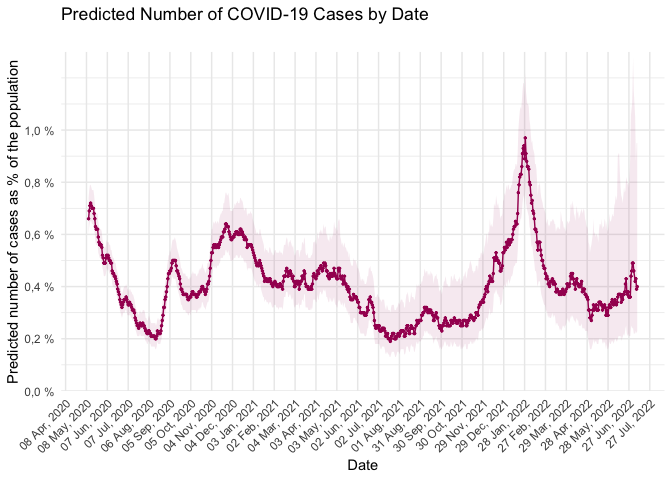
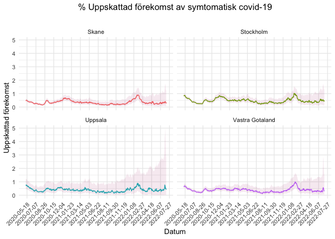

# covidsymptom <a href='https://github.com/csss-resultat/covidsymptom'></a>

<!-- badges: start --->

[](https://cran.r-project.org/package=covidsymptom)

[](https://github.com/csss-resultat/covidsymptom)
[](https://lifecycle.r-lib.org/articles/stages.html#experimental)
[](https://github.com/csss-resultat/covidsymptom/commits/master)

<!-- badges: end -->

The covidsymptom R package provides an easy way to import open data from
the COVID Symptom Study-Sweden. The package includes four datasets:

-   `national_estimates` - daily estimated incidence of symptomatic
    COVID-19 in Sweden
-   `county_estimates` - daily estimated incidence of symptomatic
    COVID-19 in Swedish counties
-   `postcode_estimates` - daily estimated incidence of symptomatic
    COVID-19 in smaller Swedish regions (2-digit postcodes)
-   `csss_tests` - daily proportion of positive COVID-19 tests reported
    by CSSS users

## Installation

Install the CRAN version:

``` r
install_packages("covidsymptom")
```

Development version of the package can be installed from Github with:

``` r
install.packages("remotes")
remotes::install_github("csss-resultat/covidsymptom")
```

## Update data

In order to respect CRAN best use practices, we will only push a new
version of the package with most recent data every one month. However,
data from COVID Symptom Study - Sweden is updated on a daily basis, thus
the dev version of the package is also updated daily. The function
`update_csss_data()` (based on a similar function from the
<a href = https://github.com/RamiKrispin/coronavirus> coronavirus
package),</a> checks updates to the dataset and re-install the package
with the most recent data (dev version).

``` r
library(covidsymptom)
update_csss_data()
```

If you want to avoid updating the package to have the most recent data,
you can use the function `get_latest_data()` to import the latest
version available. Notice however that this won’t re-write the package
datasets.

``` r
library(covidsymptom)
national_estimates <- get_latest_data(data_level = "national")

head(national_estimates)
#>        Datum Uppskattning Low_CI High_CI
#> 1 2020-05-11         0.66   0.60    0.74
#> 2 2020-05-12         0.69   0.63    0.77
#> 3 2020-05-13         0.71   0.65    0.79
#> 4 2020-05-14         0.72   0.65    0.79
#> 5 2020-05-15         0.71   0.65    0.78
#> 6 2020-05-16         0.70   0.64    0.77
```

## Usage

-   National estimates

``` r
library(ggplot2)
library(dplyr)

covidsymptom::national_estimates %>%
  ggplot(aes(x = Datum, y = Uppskattning)) +
  geom_line(col = "#a60f61") +
  geom_point(col = "#a60f61", size = 0.5) +
  labs(x = "Date", y = "Predicted number of cases as % of the population",
       title = "Predicted Number of COVID-19 Cases by Date",
       subtitle = "")  +
  scale_y_continuous(limits = c(0, 1),
                     breaks = seq(0, 1, 0.2),
                     labels = paste0(format(seq(0, 1, 0.2), decimal.mark = ","), " %"), # add % sign to the labels
                     expand = c(0,0)) +
  scale_x_date(date_breaks = "10 days", date_labels = "%d %b") + # can be "1 day", "2 days", etc.
  theme_minimal() +
  theme(axis.text.x = element_text(angle = 45, hjust = 1), panel.grid.minor.x = element_blank()) +
  geom_ribbon(aes(ymin = Low_CI, ymax = High_CI), fill = "#a60f61", alpha = 0.09)
```



-   Counties’ estimates

``` r
library(ggplot2)
library(dplyr)
library(lubridate)

counties_selection <- c("Skane", "Stockholm", "Vastra Gotaland", "Uppsala")

covidsymptom::county_estimates %>%
  filter(Lan %in% counties_selection) %>%
  ggplot(aes(x = Datum, y = Uppskattning, color = Lan)) +
      geom_line() +
      geom_point(size = 0.5) +
      labs(x = "Datum", y = "Uppskattad förekomst", title = "% Uppskattad förekomst av symtomatisk covid-19", subtitle = "") +
      scale_x_date(date_breaks = "30 days") +
      theme_minimal() + 
      theme(axis.text.x = element_text(angle = 45, hjust = 1), panel.grid.minor.x = element_blank(),
            legend.position = "none", plot.title = element_text(hjust = 0.5)) + 
      geom_ribbon(aes(ymin = Low_CI, ymax = High_CI), color = "transparent", fill = "#a60f61", alpha = 0.09) +
      facet_wrap(. ~ Lan) 
```



-   2-digit postcodes’ estimates

COVID Symptom Study - Sweden provides also predictions at
<a href = "https://csss-resultat.github.io/sverige2siffror/">2-digit
postcode levels</a>.

``` r
library(ggplot2)
library(dplyr)
library(lubridate)
library(gt)

stockholm_codes <- c('11', '12', '13', '14', '15', '16', '17', '18', '19', '76')

filtered_data <- covidsymptom::postcode_estimates %>%
  filter(Postnummer %in% stockholm_codes & Datum == as.Date("2021-01-31") & !is.na(Uppskattning))

min_pred <- min(filtered_data$Uppskattning)
max_pred <- max(filtered_data$Uppskattning)
pred_palette <- scales::col_numeric(c("#f9dee2", "#5E0B21"), domain = c(min_pred, max_pred), alpha = 0.75)


filtered_data %>%
  arrange(desc(Uppskattning)) %>%
  gt(.) %>%
  tab_header(
    title = md("**Predicted number of cases as % of the population**"),
    subtitle = "Stockholm's 2-digit regions"
  ) %>% 
  cols_width(starts_with("Datum") ~ px(95)) %>%
  tab_style(
    locations = cells_column_labels(columns = everything()),
    style     = list(
      cell_borders(sides = "bottom", weight = px(3)),
      cell_text(weight = "bold")
    )) %>% 
  cols_align("center") %>% 
  data_color(columns = vars(Uppskattning),
             colors = pred_palette) %>%
  tab_source_note(source_note = "Data: COVID Symptom Study Sweden") %>%
  tab_options(
    column_labels.border.top.width = px(3),
    data_row.padding = px(3),
    source_notes.font.size = 12,
    table.font.size = 12,
    heading.align = "center",
    row_group.background.color = "grey")
```

<a></a>

``` r
stockholm_codes <- c('11', '12', '13', '14', '15', '16', '17', '18', '19')

covidsymptom::postcode_estimates %>%
  filter(Postnummer %in% stockholm_codes) %>%
  ggplot(aes(x = Datum, y = Uppskattning, color = Postnummer)) +
  geom_line() +
  geom_point(size = 0.5) +
  labs(x = "Datum", y = "Uppskattad förekomst", title = "% Uppskattad förekomst av symtomatisk covid-19", subtitle = "") +
  scale_x_date(date_breaks = "60 days") +
  theme_minimal() + 
  theme(axis.text.x = element_text(angle = 45, hjust = 1), panel.grid.minor.x = element_blank(),
        legend.position = "none", plot.title = element_text(hjust = 0.5)) + 
  geom_ribbon(aes(ymin = Low_CI, ymax = High_CI), color = "transparent", fill = "#a60f61", alpha = 0.09) +
  facet_wrap(. ~ Postnummer, scales= "free")   
```


## Dashboard

A supporting dashboard is available
[here](https://csss-resultat.shinyapps.io/csss_dashboard/)


## About COVID Symptom Study - Sweden

The COVID Symptom Study is a non-commercial project that uses a free
smartphone app to facilitate real-time data collection of symptoms,
exposures, and risk factors related to COVID-19. The app was developed
by researchers at King’s College and Guys and St Thomas’ Hospitals in
London in partnership with health science company Zoe Global
Ltd. Baseline data and recurring daily questions are described in
<a href = https://science.sciencemag.org/content/368/6497/1362> Drew et
al (Science, 2020)</a>. The app was launched in the UK and US March
2020. In Sweden, the study is based at Lund University and, as per a
collaboration agreement on 28 July 2020, Uppsala University. The app was
launched in Sweden on April 29, 2020 as part of a national research
initiative on COVID-19. To date, &gt;4.5 million participants in the
three countries are using the app, \~202,000 of whom live in Sweden.
Participants have so far made \~271 million data entries, with Swedish
participants contributing \~11 million of these.
